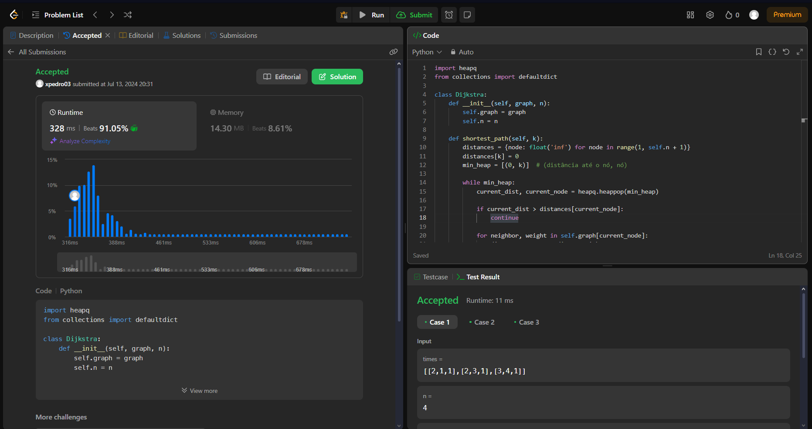
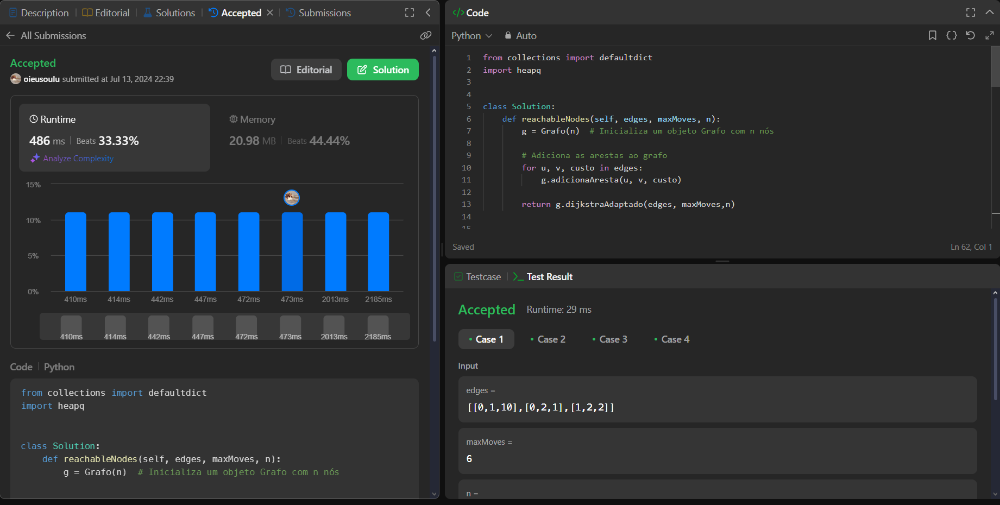
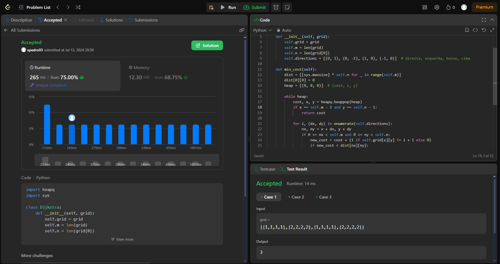

# LeetJudge

**Número da Lista**: 10 
**Conteúdo da Disciplina**: Grafos 2 

## Alunos
| Matrícula  | Aluno                           |
| ---------- | ------------------------------- |
| 22/1007653 | Luciano Ricardo da Silva Junior |
| 21/1031468 | Pedro Victor Salerno Martins    |

## Sobre 
Resolver duas questões dificeis e duas media utilizando os conceitos de grafos aprendidos na disciplina de Projetos de Algoritimos da Universidade de Brasilia.

## Video de apresentação
<!-- O video de apresentação pode ser encontrado em [link](video.mp4) -->

## Screenshots

**Questão 743 após submição**

**Questão 882 após submição**

**Questão 1368 após submição**

**Questão 1584 após submição**

## Instalação

**Linguagem**: Python 
**Framework**: Não tem 

## Uso

Você pode apenas entrar na questão especifica do juiz virtual e fazer a submição.

As questões são:

- [Questão 743](https://leetcode.com/problems/network-delay-time/description/)
- [Questão 882](https://leetcode.com/problems/reachable-nodes-in-subdivided-graph/description/)
- [Questão 1368](https://leetcode.com/problems/minimum-cost-to-make-at-least-one-valid-path-in-a-grid/description/)
- [Questão 1584](https://leetcode.com/problems/min-cost-to-connect-all-points/description/) 

Alternativamente você pode ter o Python instalado e executar os arquivos de teste.
